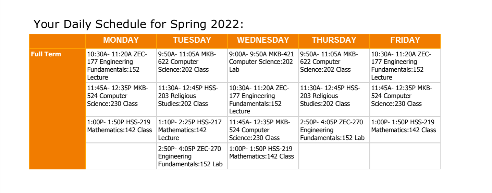

# UTK Schedule Parser

## Preface
University of Tennessee provides students with generated schedules for their classes, such as:

## About the Project

As a member of UT's Asian American InterVarsity club, I wanted to reduce tedious work for something that could be automated with the common data that the university granted us - those `.pdf` schedules.

## Getting Started

### Prerequisites

- `apt install ghostcript python3-tk`
- `pip install -r requirements.txt`

### Installation
- `git clone https://github.com/SamJSui/UTK_Schedule_Parser`

## Usage

- Add your `.pdf` into the `Schedules/`
  - To accurately display names, rename the `.pdf` to `firstname-lastname.pdf`
- While in the `UTK_Schedule_Parser/` directory, run `python3 ./Parser/parser.py` to execute the program and produce `times.csv`

## To Do

- Port Tableau visual to Colab Notebook