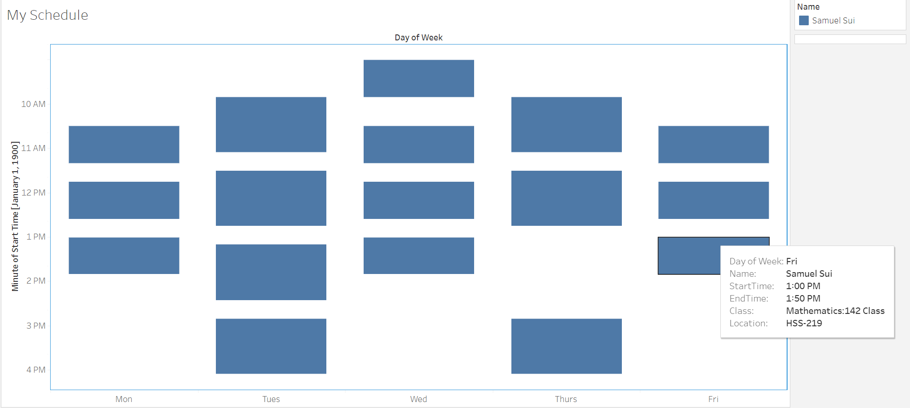

# Tableau

Transforming your Schedule into a Visualization



## Preface

The Python parser automates and makes it easier to overlay multiple people's schedules, reducing time spent on tedious work.

## Introduction

- Go to [Tableau Public](https://public.tableau.com), create an account and create a new viz.
- Upload the outputted spreadsheet (in `Parser/` directory) into Tableau to allow the software to extract the data
- Open up a new sheet, assign **Day of Week** to columns, and **Start Time** to rows
- Right-click on **Start Time**, hover over more and select 'Minute 9:03 PM'
- Right-click on your tables and create calculated fields for each using these commands:
  - Duration : `[End Time]-[Start Time]`
  - StartTime/EndTime (Replace Start Time with End Time respectively):
  - ```
    IF DATEPART('hour',[Start Time])=12 THEN "12:" +
    (IF DATEPART('minute',[Start Time])=0 THEN STR(DATEPART('minute',[Start Time])) + "0 AM"
     ELSE STR(DATEPART('minute',[Start Time])) + " PM" 
     END)
    ELSEIF DATEPART('hour',[Start Time])=0 THEN "12:" + 
        (IF DATEPART('minute',[Start Time])=0 THEN STR(DATEPART('minute',[Start Time])) + "0 AM"
         ELSE STR(DATEPART('minute',[Start Time])) + " AM"
         END)
    ELSEIF DATEPART('hour',[Start Time])>12 THEN STR(DATEPART('hour',[Start Time])-12)+":"+
        (IF DATEPART('minute',[Start Time])=0 THEN STR(DATEPART('minute',[Start Time])) + "0 PM"
         ELSE STR(DATEPART('minute',[Start Time])) + " PM"
         END)
    ELSE STR(DATEPART('hour',[Start Time]))+":" +
        (IF DATEPART('minute',[Start Time])=0 THEN STR(DATEPART('minute',[Start Time])) + "0 AM"
         ELSE STR(DATEPART('minute',[Start Time])) + " AM"
         END)
    END
    ```
- Set the graph type as Gantt Bar, set the color respective to **Name** and size respective to **SUM(Duration)**
- Drag the remaining attributes (**StartTime, EndTime, Location and Class**) and click on Tooltip to modify the hover
  - ```
    Day of Week: <Day of Week>
    Name: <Name>
    Start Time: <ATTR(StartTime)>
    End Time: <ATTR(EndTime)>
    Location: <ATTR(Location)>
    Class: <ATTR(Class)>
    ```
- Right-click the y-axis to edit and set the order in reverse to set the times top to bottom
- *Optional:* Set the fit to Fit Width to take up the entire dashboard